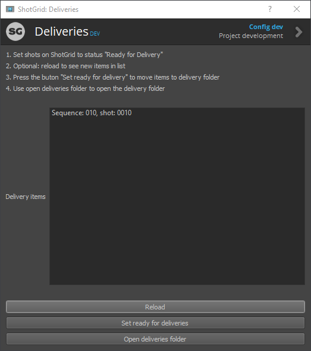

# ShotGrid deliveries app
This app will get all shots with the "Ready for Delivery" status, and copy the publishes to the delivery folder with the correct naming convention. Currently used at the Netherlands Film Academy.

## User interface

## Requirements
* This app will need a sg_projectcode field on the project in ShotGrid

## Settings
* `delivery_sequence`: template to move the file sequence to
* `delivery_folder`: template to the delivery folder
* `default_root`: string for the root project, defaults to `primary`.
* `delivery_status`: string with the shot shortcode status for shots to be delivered. Defaults to `rfd` for `Ready for Delivery`.
* `delivered_status`: string with the shot shortcode status for shots that are delivered. Defaults to `fin` for `Final`.
